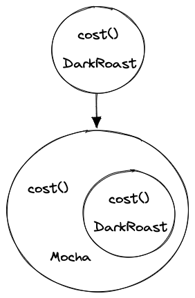
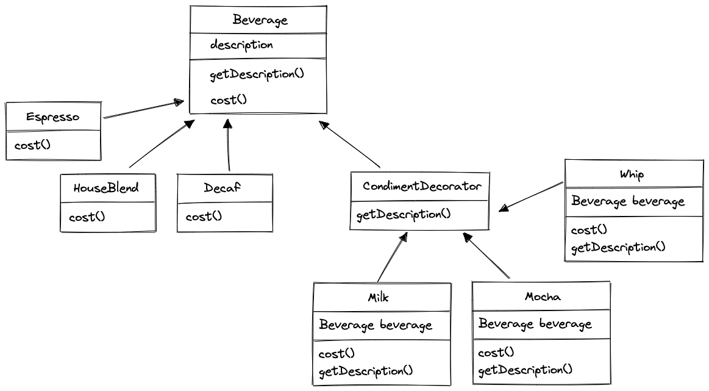

# 데코레이터 패턴

### 데코레이터 패턴이란?

객체를 **장식(decorate)** 하는것!



위와 같이 순차적으로 계속 감싸면 된다!

### 하나 하나 이해해보자... 😫

- [ ]  데코레이터의 슈퍼클래스는 자신이 장식하고 있는 객체의 슈퍼클래스와 같다.
- [ ]  한 객체를 여러개의 데코레이터로 감쌀 수 있습니다.
- [ ]  데코레이터는 자신이 감싸고 있는 객체와 같은 슈퍼클래스를 가지고 있기에 원래 객체(싸여 있는 객체)가 들어갈 자리에
  데코레이터 객체를 넣어도 상관 없습니다.
- [ ]  **데코레이터는 자신이 장식하고 있는 객체에게 어떤 행동을 위임하는 일 말고도 추가 작업을 수행할 수 있다!**
- [ ]  객체는 언제든지 감쌀 수 있으므로 실행 중에 필요한 데코레이터를 마음대로 적용할 수 있습니다.

### Beverage 만들어보기



### 그래서 데코레이터 패턴이 뭔데?

```java
BufferedReader br = new BufferedReader(new InputStreamReader(System.in));
BufferedReader br = new BufferedReader(new FileReader("sample.txt"));
BufferedReader br = new BufferedReader(new InputStreamReader(socket.getInputStream());

String input = br.readLine();
```

코딩 테스트 문제 풀 때, 테스트 코드에서 입력값을 받기 위해서 사용했던 `[java.io](http://java.io)` 가 데코레이터 패턴이였다.

`InputStreamReader` 를 `BufferedReader` 로 감싸서, 유연하게 기능을 확장시킬 수 있습니다.

### BufferedReader vs Scanner

- [ ]  BufferedReader는 thread-safe하지만 Scanner는 그렇지 않다.
- [ ]  Scanner는 정규 표현식을 써서 구문 분석을 할 수 있다. (파싱 같은 작업을 하는데 편리하다.)
- [ ]  Scanner는 IOException 을 숨기고, BufferedReader는 이를 드러낸다.
- [ ]  BufferedReader의 기본 버퍼 크기가 더 크고, 데이터를 읽기만 하는 경우 Scanner 보다 빠르게 처리할 수 있다.

### 🥸  데코레이터 패턴 아는척하기

> **데코레이터 패턴**(Decorator Pattern)으로 객체에 추가 요소를 동적으로 더할 수 있습니다.
데코레이터를 사용하면 서브클래스를 만들 때보다 훨씬 유연하게 기능을 확장할 수 있습니다.
> 