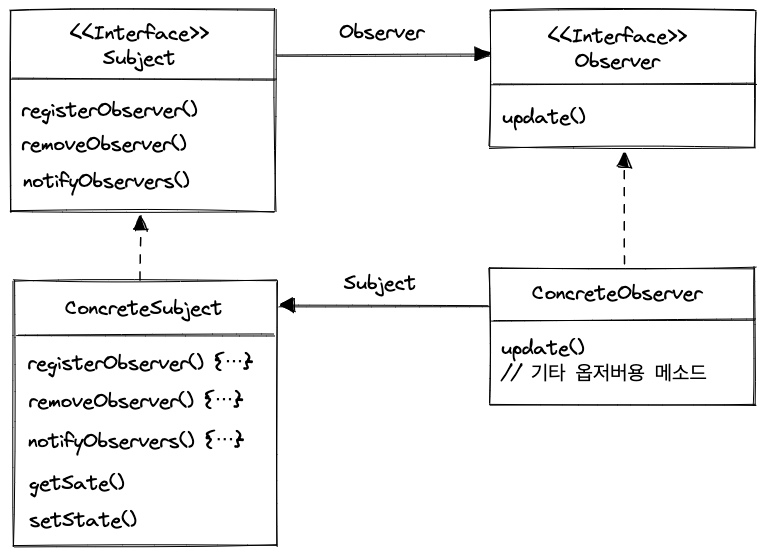
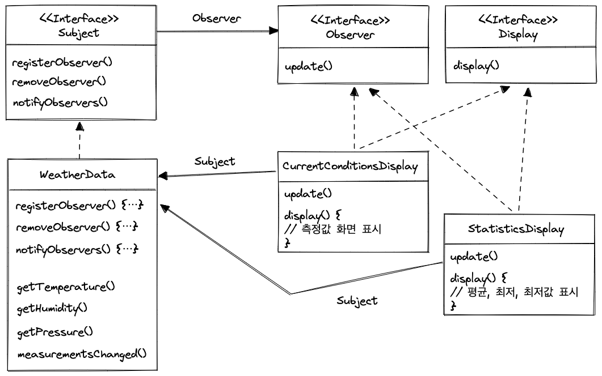

# 옵저버 패턴

### 옵저버 패턴이란?

- 신문사(subject) + 구독자(object) = 옵저버 패턴
- 주제(Subject)에서 중요한 정보를 관리하고, 주제 데이터가 바뀌면 옵저버(구독하고 있는)에게 그 소식이 전해집니다.



- 주제 역할의 구상 클래스에는 항상 Subject 인터페이스를 구현해야 하고,

  구독자 등록과 해지, 상태가 바뀔때마다 모든 구독자에게 연락하는 메소드도 구현해야 합니다.

- 구독자는 상태가 바뀌었을 때, 호출되는 update 메소드밖에 없습니다.

## 느슨한 결합의 위력

- **느슨한 결합(Loose Coupling)** 은 객체들이 상호작용 할 수는 있지만, 서로를 잘 모르는 관계를 의미합니다.

  → 유연성이 좋아짐 👍

- **주제는 옵저버가 특정 인터페이스(Observer)를 구현한다는 사실만 압니다.**
- **옵저버는 언제든 새로 추가 가능!**
    - Observer만 implements 하기만 하면 언제든지 추가 가능합니다.
    - 새로운 형식의 옵저버를 추가할 때도 주제를 변경할 필요가 없습니다.
- **주제와 옵저버는 서로 독립적으로 재사용 가능!**
    - 주제와 옵저버가 달라져도 서로 영향을 끼치지 않습니다.

### 기상청 구현하기



- WeatherData에서 값이 변화 됬을 때, Observer의 update를 호출합니다.

    ```java
    public class WeatherData implements Subject {
      private final List<Observer> observers;
    	...
    
      public WeatherData() {
        observers = new ArrayList<Observer>();
      }
    	
    	...
    
      @Override
      public void notifyObservers() {
        for (Observer observer : observers) {
          observer.update();
        }
      }
    
      public void measurementsChanged() {
        notifyObservers();
      }
    
    	...
    }
    ```


### TMI

- 자바에도 Observable 클래스와 Observer 인터페이스가 있었지만, 자바 9 이후로는 쓰이지 않습니다.
    - 각자 자신의 코드에서 기본적인 옵저버 패턴을 지원하는게 더 편하다는 사람들과

      더 강력한 기능을 스스로 구현하는 게 더 낫겠다고 하는 사람이 늘었기 때문이죠.

- 자바빈은 Bean에서 PropertyChangeEvents로 유형 속성이 바뀌었을 때, PropertyChangeListener에 알림을 보내 주는 기능을 제공!
    - 또한 비동기 스트림(asynchronous stream)을 처리하는 Flow API 관련된 출판-구독 구셩요소도 제공합니다.
- Observer를 알림 순서에 의존하지 말라는 JDK 권고가 있습니다.

  → 주제에서 옵저버로 알림가는 순서를 고려하지 말자.


### 풀 방식으로 코드 바꾸기

- Observer 인터페이스

    ```java
    public interface Observer {
      void update(float temperature, float humidity, float pressure);
    }
    ```

  🤔 변경 값(매개변수)이 하나더 늘어난다면?

  → 메소드를 하나더 만들거나 수정해서 관련된 모든 클래스를 수정해야 합니다.

  이를 위해 update 메소드를 인자 없이 필요한 값만 가져올 수 있도록 Subject 구현 클래스에 get 함수와 함께 구현해 봅시다!

- push → pull 변경 코드 참고하기 :  [[Git] Commit cf9d88f](https://github.com/midasWorld/DesignPattern/commit/cf9d88f6d8eecd69dd803048aa1806bbb2bfccdd)

### 🥸  옵저버 패턴 아는척하기

> **옵저버 패턴**(Observer Pattern)은 한 객체의 상태가 바뀌면 그 객체에 의존하는 다른 객체에게 연락이 가고
자동으로 내용이 갱신되는 방식으로 일대다(one-to-many) 의존성을 정의합니다.
> 