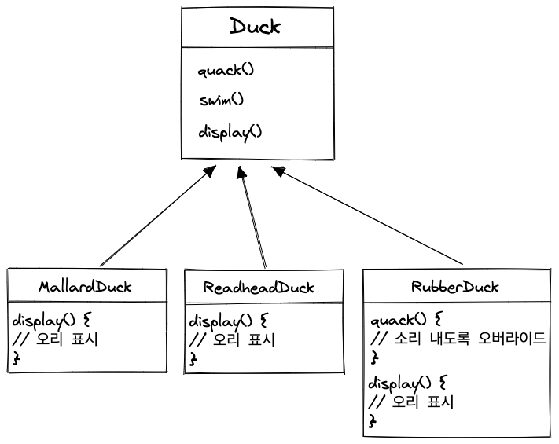
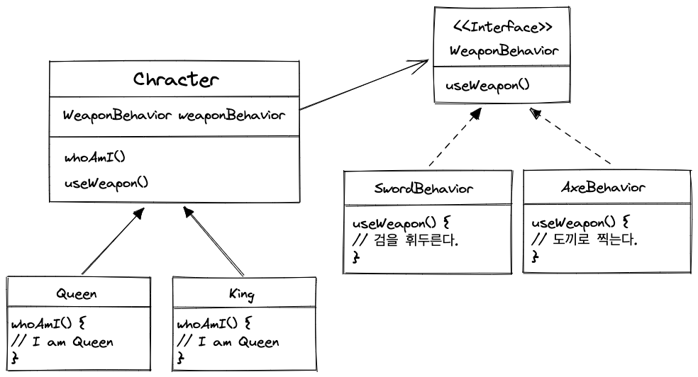

# 전략 패턴

### 🤔  **오리에 fly() 기능을 추가 한다면 어떻게 해야 될까?**

`Duck` 클래스에 fly()를 추가하게 된다면, 그를 상속하고 있는 모든 클래스에 영향을 주게 됩니다.
 
(실제로 fly() 기능이 필요 없는 오리도 말이죠.)
 
이런식으로 변경하게 된다면 유지보수 입장에서는 지옥같은 나날이 펼쳐질 것입니다. 👹
 
 
이를 위해서 할수 있는 방법은 ✨  **행동(= 메소드)을 다른 클래스에 위임하는 것입니다.**

### 📝 인터페이스와 캡슐화

**추가 되거나 바뀌는 부분은 따로 뽑아서 캡슐화 가능한지 검토해야 합니다.**
 
이렇게 하면, 기존의 것들에 영향을 끼치지 않고 독립적으로 변화시킬 수 있다.

### 👻  두 클래스를 합치는 방법

> “A는 B이다"보다 “A에는 B가 있다"가 나을 수 있다.
ex) Character 클레스에는 WeaponBehavior가 있다.
>

이렇게 두 클래스를 합치는 것을 **'구성(composition)을 이용한다.’** 라고 합니다.

### 🥸  전략 패턴 아는척하기.

> **전략 패턴**(Strategy Pattern)은 알고리즘군을 정의하고
캡슐화해서 각각의 알고리즘군을 수정해서 쓸 수 있게 해 줍니다.
전략 패턴을 사용하면 클라이언트로부터 알고리즘을 분리해서 독립적으로 분리할 수 있습니다.
> 